<h2>TensorFlow-FlexUNet-Image-Segmentation-Knee-X-Ray-Two-Classes-Edge-Detection (2026/10/02)</h2>
Sarah T. Arai 
Software Laboratory antillia.com  
This is the first experiment in Image Segmentation for <b>Knee X-Ray Two Classes (Grades) Edge Detection</b>
 based on
our <a href="https://github.com/sarah-antillia/TensorFlow-FlexUNet-Image-Segmentation-Model">TensorFlowFlexUNet Model</a>
 (<b>TensorFlow Flexible UNet Image Segmentation Model for Multiclass</b>) and a upscaled PNG
 <a href="https://drive.google.com/file/d/1kM-yjagZmrLFj0ugcPeMT0fHGqiPlWZJ/view?usp=sharing">
Augmented-Knee-X-Ray-Two-Classes-ImageMask-Dataset.zip</a> with colorized masks 
(<a href="https://creativecommons.org/licenses/by/4.0/">CC BY 4.0</a>), 
which was derived by us from the following two datasets: 
  
<b>Dataset 1:</b>
X-Ray images in <b>MedicalExpert-I</b> of
<a href="https://www.kaggle.com/datasets/orvile/digital-knee-x-ray-images">
<b>Digital Knee X-ray Images</b>
</a> 
 
<b>Dataset 2:</b>
Edge_Detection masks in <b>MedicalExpert-I</b> of 
<a href="https://www.kaggle.com/datasets/shuvokumarbasakbd/knee-x-ray-digital-colorized-images">
<b>Knee X-ray Digital Colorized Images</b>
</a> 
 
 
In this experiment, we aggregated the data originally categorized into four classes 
(Doubtful, Mild, Moderate, and Severe) into two classes (<b>Doubtful_or_Mild</b> and <b>Moderate_or_Severe</b>) 
for simplicity.
   

<b>Actual Image Segmentation for Knee X-Ray Images</b> 
As shown below, the inferred masks resemble the ground-truth masks.  
 
<b>class_color_map = {Doubtful_or_Mild: green, Moderate_or_Severe: dark_red)} </b>  
<table>
<tr>
<th width="320" height="auto">Input: image</th>
<th width="320" height="auto">Mask (ground_truth)</th>
<th width="320" height="auto">Prediction: inferred_mask</th>
</tr>
<tr>
<td></td>
<td></td>
<td></td>
</tr>
<tr>
<td></td>
<td></td>
<td></td>
</tr>
<tr>
<td></td>
<td></td>
<td></td>
</tr>
</table>

 
<h3>1. Dataset Citation</h3>
The dataset used here was derived from the following two datasets on the Kaggle website.
  
<b>Dataset 1: </b>
X-Ray gray scale images in <b>MedicalExpert-I</b> of
<a href="https://www.kaggle.com/datasets/orvile/digital-knee-x-ray-images">
<b>Digital Knee X-ray Images</b>
</a> by Orvile
 
<b>Dataset 2: </b>
Edge_Detection masks in <b>MedicalExpert-I</b> of 
<a href="https://www.kaggle.com/datasets/shuvokumarbasakbd/knee-x-ray-digital-colorized-images">
<b>Knee X-ray Digital Colorized Images</b>
</a> by Medi Hunter - 4004.
  
The following explanation (excerpt) was taken from the first website above.
For more information of the second dataset, please refer to 
<a href="https://www.kaggle.com/datasets/shuvokumarbasakbd/knee-x-ray-digital-colorized-images">
<b>Knee X-ray Digital Colorized Images</b>
</a>  
<b>About Dataset</b> 
<b>Digital Knee X-Ray Images</b> 
<b>A Carefully Curated Dataset for Knee Osteoarthritis Grading</b> 
Welcome to this comprehensive dataset featuring 1,650 high-quality digital X-ray images of knee joints,
 sourced from top hospitals and diagnostic centers.  
 Each image is meticulously annotated by medical experts using the Kellgren and Lawrence (K&L) grading system,
  the gold standard for assessing knee osteoarthritis severity. Perfect for data scientists, researchers,
   and innovators, this dataset is ideal for advancing machine learning, pattern recognition, 
and medical image analysis—think automated osteoarthritis detection systems and beyond!
  
<b>Why This Dataset Matters</b> 
Knee osteoarthritis (OA) impacts millions globally, and accurate diagnosis is key to effective treatment.  
The Kellgren and Lawrence system helps radiologists evaluate OA severity through radiographic features. 
 This dataset provides a robust, labeled collection of knee X-rays to drive the development of  
 automated diagnostic tools, merging medicine and technology for better health outcomes.
  
<b>What’s Inside</b> 
Digital Knee X-Rays: 1,650 grayscale, 8-bit images captured using a PROTEC PRS 500E X-ray machine. 
Expert Annotations: Each image is labeled by two medical experts with its K&L grade, likely in filenames 
or a metadata file. 
Cartilage Insights: Includes a novel approach to extract cartilage regions of interest (ROIs) based on pixel density—ROI details may be included (check the files!).
  
<b>License</b> 
<a href="https://creativecommons.org/licenses/by/4.0/">CC BY 4.0</a>
 
 
<h3>
2. Knee-X-Ray ImageMask Dataset
</h3>
<h3>2.1 Download ImageMask Dataset</h3>
 If you would like to train this Knee-X-Ray Segmentation model,
 please download the dataset from Google Drive  
 <a href="https://drive.google.com/file/d/1kM-yjagZmrLFj0ugcPeMT0fHGqiPlWZJ/view?usp=sharing">
Augmented-Knee-X-Ray-Two-Classes-ImageMask-Dataset.zip</a>. 
Expand the downloaded ImageMaskDataset and put it under the <b>./dataset</b> folder.
 
<pre>
./dataset
└─Knee-X-Ray-Two-Classes
    ├─test
    │   ├─images
    │   └─masks
    ├─train
    │   ├─images
    │   └─masks
    └─valid
         ├─images
         └─masks
</pre>
 
<b>Knee-X-Ray-Two-Classes Statistics</b> 
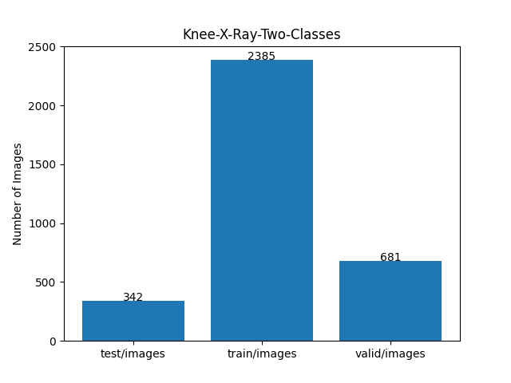 
 
As shown above, the number of images in the training and valid datasets is large enough to use for the
 training set of our segmentation model.
 
<h3>2.2 Derivation of ImageMask Dataset</h3>
The folder structure of our <b>MedicalExpert-I</b> derived from the original dataet is as follows.
 
<pre>
./Knee X-ray Images
 └─MedicalExpert-I
    │
    ├─1Doubtful
    │   ├─Edges
    │   └─Image
    │    
    ├─2Mild
    │   ├─Edges
    │   └─Images
    │
    ├─3Moderate
    │   ├─Edges
    │   └─Images
    │
    └─4Severe
         ├─Edge
         └─Images 
</pre>
It consits of the four grades, Doubtful,Mild, Moderate and Severe data.
<ul>
<li>
<b>Images:</b>Knee X-Ray gray scale images taken from <b>Dataset 1</b>.
</li>
<li>
<b>Edges: </b>Edge masks images taken from Edge_Detection subset in <b>Dataset 2</b>.
</ul>
 
<b>Step 1</b> 
We generated a 2x enlarged Image and Edge Mask master dataset with colorized masks 
<b>(Doubtful_or_Mild: green, Moderate_or_Severe: dark_red) </b>
from the images in <b>Images</b> and the corresponding 
masks in <b>Edges</b>. 
 
<b>Step 2</b> 
To address the limited size of the master, we generated our own 
Augmented ImageMaskDataset from the master by using a simple horizontal and vertical image flipping tools.
 
<h3>2.3 Train Sample Images and Masks</h3>
<b>Train_sample_images</b> 
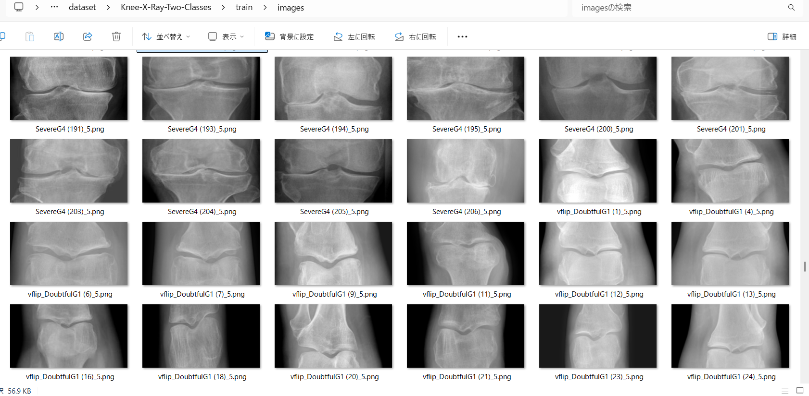
 
<b>Train_sample_masks</b> 
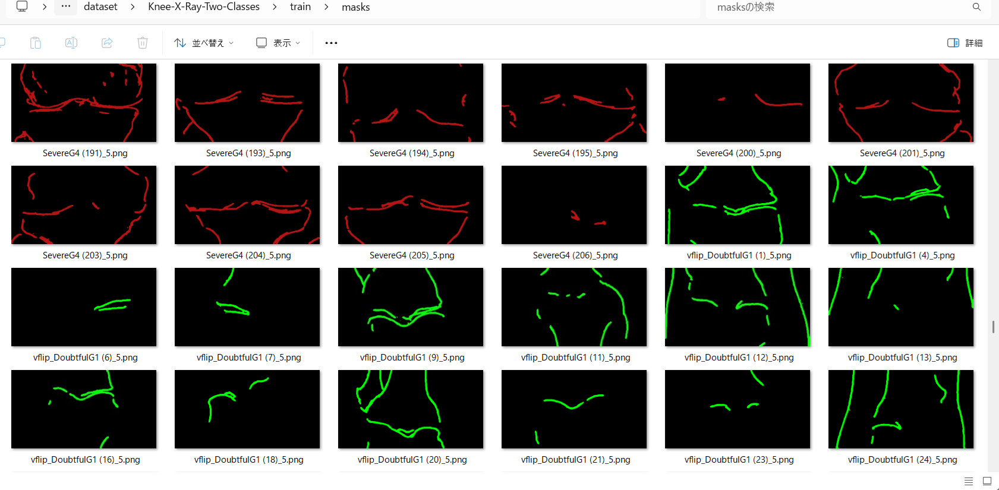
 

<h3>
3. Train TensorFlowFlexUNet Model
</h3>
 We trained the Knee-X-Ray TensorFlowFlexUNet model using the following
<a href="./projects/TensorFlowFlexUNet/Knee-X-Ray-Two-Classes/train_eval_infer.config"> <b>train_eval_infer.config</b></a> file.  
Please move to ./projects/TensorFlowFlexUNet/Knee-X-Ray-Two-Classes and run the following bat file. 
<pre>
>1.train.bat
</pre>
This runs the following command. 
<pre>
>python ../../../src/TensorFlowFlexUNetTrainer.py ./train_eval_infer.config
</pre>

<b>Model parameters</b> 
Defined a small <b>base_filters=16 </b> and large <b>base_kernels=(11,11)</b> for the first Conv Layer of Encoder Block of 
<a href="./src/TensorFlowFlexUNet.py">TensorFlowFlexUNet.py</a> 
and a large <b>num_layers=8</b> (including a bridge between Encoder and Decoder Blocks).
<pre>
[model]
; You may specify your own UNet class derived from our TensorFlowFlexModel
model         = "TensorFlowFlexUNet"
generator     =  False
image_width    = 512
image_height   = 512
image_channels = 3
num_classes    = 3
base_filters   = 16
base_kernels   = (11,11)
num_layers     = 8
dropout_rate   = 0.04
dilation       = (1,1)
</pre>
<b>Learning rate</b> 
Defined a small learning rate.  
<pre>
[model]
learning_rate  = 0.00007
</pre>
<b>Loss and metrics functions</b> 
Specified "categorical_focal_dice_loss" and <a href="./src/dice_coef_multiclass.py">"dice_coef_hybrid"</a>,
and weight parameters <b>hybrid_alpha</b> and <b>hybrid_beta</b> for <b>dice_coef_hybrid</b> function. 
<pre>
[model]
loss           = "categorical_focal_dice_loss"
metrics        = ["dice_coef_hybrid"]
; Experimental two weight parameters to calculate "dice_coef_hybrid" metric.
hybrid_alpha   = 1.7
hybrid_beta    = 0.3
</pre>
<b>Dataset class</b> 
Specifed <a href="./src/ImageCategorizedMaskDataset.py">ImageCategorizedMaskDataset</a> class. 
<pre>
[dataset]
class_name    = "ImageCategorizedMaskDataset"
</pre>
 
<b>Learning rate reducer callback</b> 
Enabled the learning_rate_reducer callback and a small reducer_patience.
<pre> 
[train]
learning_rate_reducer = True
reducer_factor     = 0.4
reducer_patience   = 4
</pre>
<b>Early stopping callback</b> 
Enabled early stopping callback with the patience parameter.
<pre>
[train]
patience      = 10
</pre>
<b>RGB Color map</b> 
Specified RGB color map dict for Knee-X-Ray 1+2 classes. 
<pre>
[mask]
mask_datatyoe    = "categorized"
mask_file_format = ".png"
;Knee-X-Ray RGB color map dict for 1+2 classes.
rgb_map = {(0,0,0):0,(0,255,0):1,(180,20,20):2}
</pre>

<b>Epoch change inference callback</b> 
Enabled <a href="./src/EpochChangeInferencer.py">epoch_change_infer callback</a></b>. 
<pre>
[train]
epoch_change_infer       = True
epoch_change_infer_dir   =  "./epoch_change_infer"
num_infer_images         = 6
</pre>

By using this callback, on every epoch change, the inference procedure can be called
 for 6 images in the <b>mini_test</b> folder. This will help you confirm how the predicted mask changes 
 at each epoch during your training process.  
  
As shown below, early in the model training, the predicted masks from our UNet segmentation model showed 
discouraging results.
 However, as training progressed through the epochs, the predictions gradually improved. 
   
 
<b>Epoch_change_inference output at starting (epoch 1, 2, 3, 4)</b> 
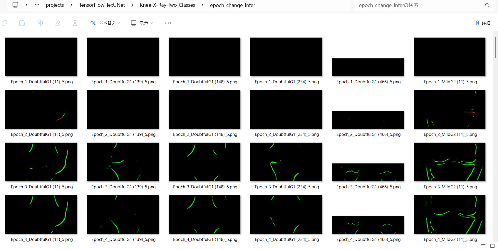 
 
<b>Epoch_change_inference output at middlepoint (epoch 18, 19, 20, 21)</b> 
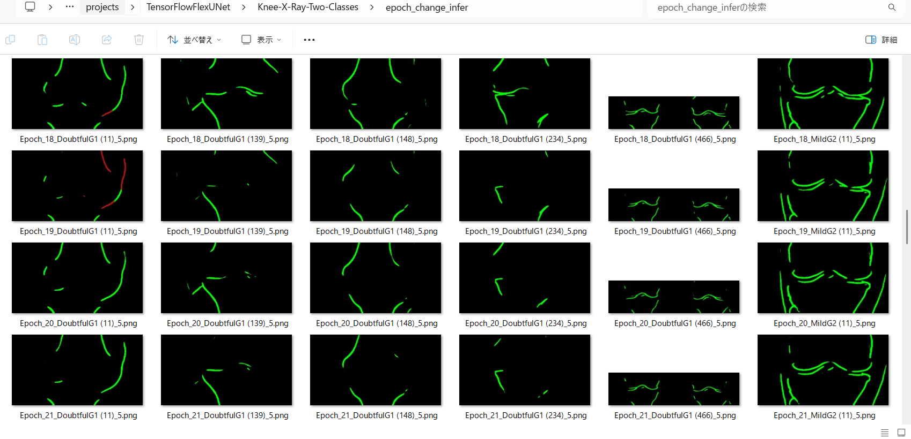 
 
<b>Epoch_change_inference output at ending (epoch 38, 39, 40, 41)</b> 
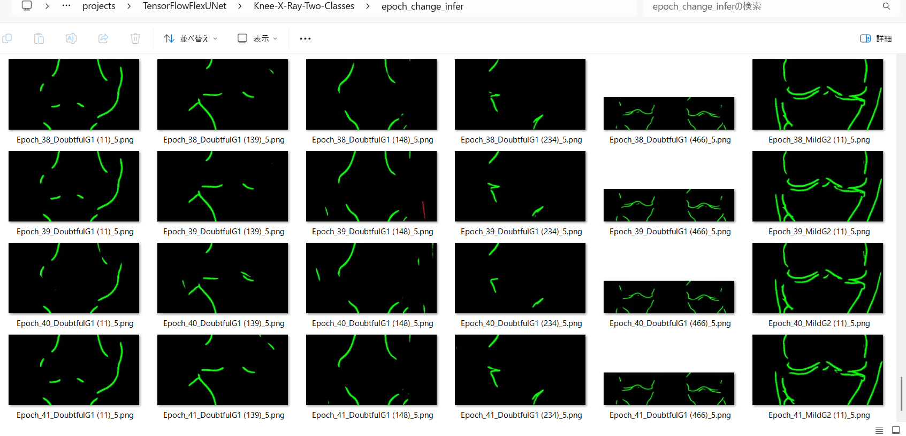 
 
In this experiment, the training process was stopped at epoch 41 by EarlyStoppingCallback. 
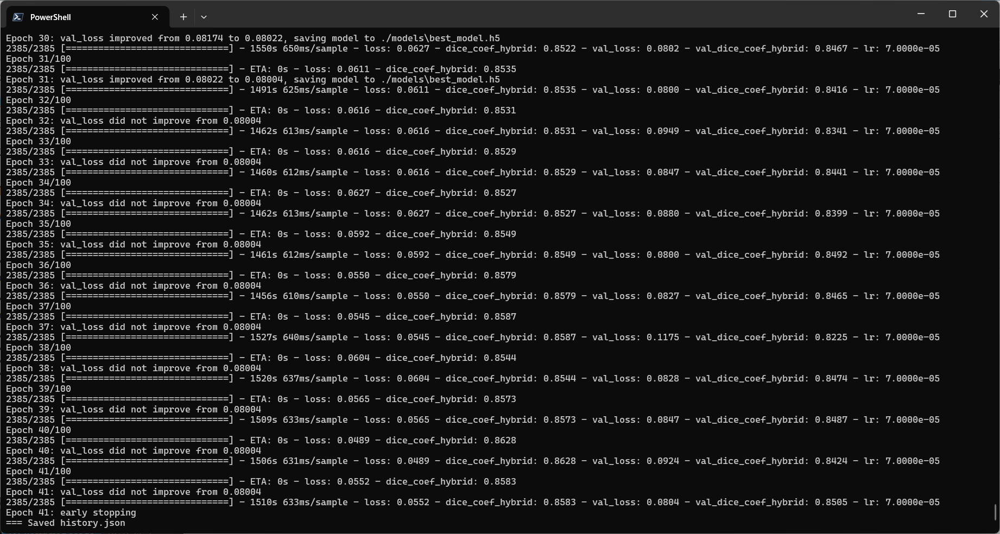 
 
<a href="./projects/TensorFlowFlexUNet/Knee-X-Ray-Two-Classes/eval/train_metrics.csv">train_metrics.csv</a> 
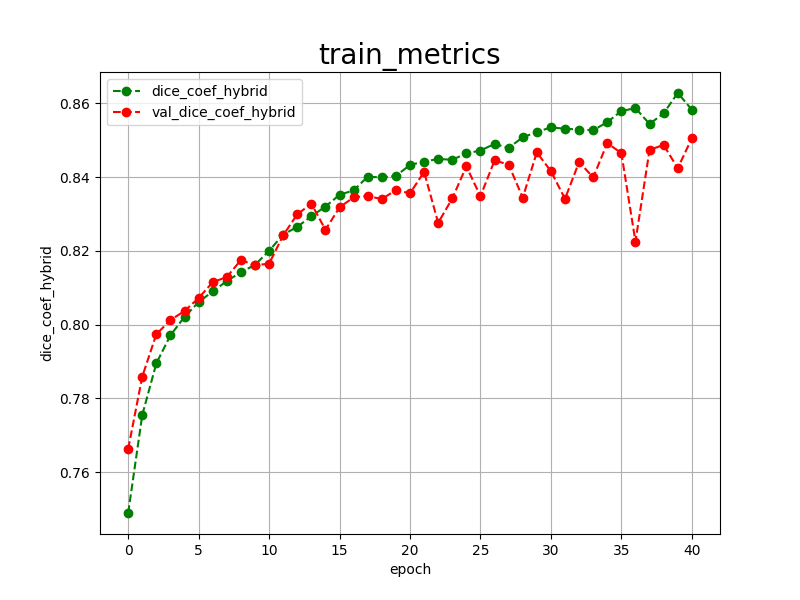 
 
<a href="./projects/TensorFlowFlexUNet/Knee-X-Ray-Two-Classes/eval/train_losses.csv">train_losses.csv</a> 
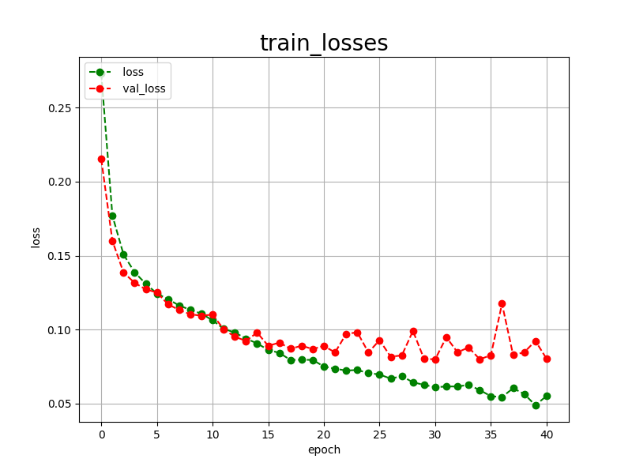 
 
<h3>
4. Evaluation
</h3>
Please move to <b>./projects/TensorFlowFlexUNet/Knee-X-Ray-Two-Classes</b> folder,
and run the following bat file to evaluate the TensorFlowUNet model for Knee-X-Ray. 
<pre>
>./2.evaluate.bat
</pre>
This runs the following command.
<pre>
>python ../../../src/TensorFlowFlexUNetEvaluator.py ./train_eval_infer_aug.config
</pre>

Evaluation console output: 
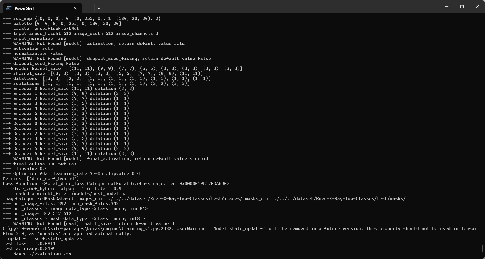
  Image-Segmentation-Knee-X-Ray

<a href="./projects/TensorFlowFlexUNet/Knee-X-Ray-Two-Classes/evaluation.csv">evaluation.csv</a> 
The loss (categorical_focal_dice_loss) on this Knee-X-Ray/test was not low, and 
dice_coef_hybrid was not high, as shown below.
 
<pre>
categorical_focal_dice_loss,0.0811
dice_coef_hybrid,0.8404
</pre>
For comparison of the four grades case,
please refer to <a href="https://github.com/sarah-antillia/TensorFlow-FlexUNet-Image-Segmentation-Knee-X-Ray-Edge-Detection">
TensorFlow-FlexUNet-Image-Segmentation-Knee-X-Ray-Two-Classes-Edge-Detection</a>
  
<h3>
5. Inference
</h3>
Please move to <b>./projects/TensorFlowFlexUNet/Knee-X-Ray-Two-Classes</b> folder
and run the following bat file to infer segmentation regions for images using the trained TensorFlowUNet model for Knee-X-Ray. 
<pre>
>./3.infer.bat
</pre>
This runs the following command.
<pre>
>python ../../../src/TensorFlowFlexUNetInferencer.py ./train_eval_infer_aug.config
</pre>

<b>mini_test_images</b> 
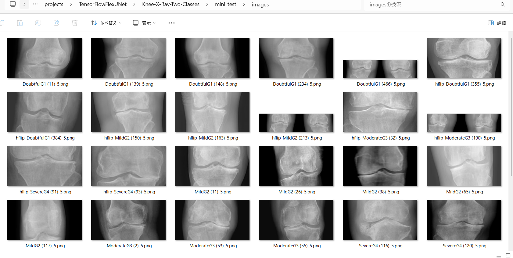 
<b>mini_test_mask(ground_truth)</b> 
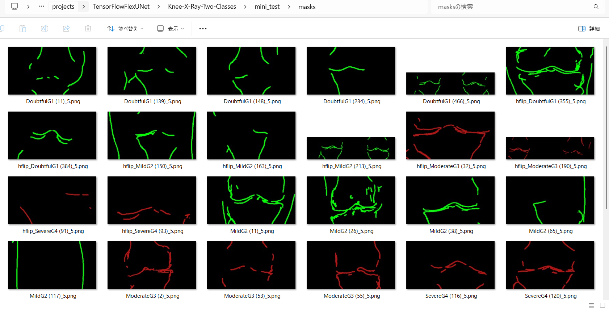 

<b>Inferred test masks</b> 
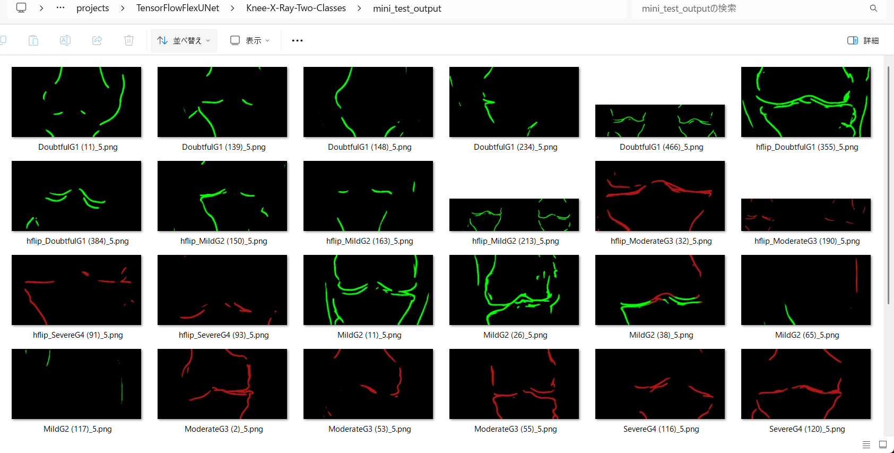 
 

<b>Enlarged images and masks for Knee-X-Ray Images</b> 
As shown below, the inferred masks look similar to the ground truth masks, but differ in the detailsc . 
 
<b>class_color_map = {Doubtful_or_Mild: green, Moderate_or_Severe: dark_red)} </b>  
<table>
<tr>
<th width="320" height="auto">Image</th>
<th width="320" height="auto">Mask (ground_truth)</th>
<th width="320" height="auto">Inferred-mask</th>
</tr>
<tr>
<td></td>
<td></td>
<td></td>
</tr>
<tr>
<td></td>
<td></td>
<td></td>
</tr>
<tr>
<td></td>
<td></td>
<td></td>
</tr>
<tr>
<td></td>
<td></td>
<td></td>
</tr>
<tr>
<td></td>
<td></td>
<td></td>
</tr>
<tr>
<td></td>
<td></td>
<td></td>
</tr>
</table>

 
<h3>
References
</h3>
<b>1. The 4 Stages of Knee Arthritis: What Your Grade Means (With X-Rays)</b> 
Dr. Cory Calendine, MD 
<a href="https://corycalendinemd.com/blog/knee-arthritis-x-ray-grades/">
https://corycalendinemd.com/blog/knee-arthritis-x-ray-grades/
</a>
  
<b>2. Automatic knee osteoarthritis severity grading based on X-ray images using a hierarchical classification method</b> 
Jian Pan, Yuangang Wu, Zhenchao Tang, Kaibo Sun, Mingyang Li, Jiayu Sun, Jiangang Liu, Jie Tian, Bin Shen 
 
<a href="https://pmc.ncbi.nlm.nih.gov/articles/PMC11571664/">https://pmc.ncbi.nlm.nih.gov/articles/PMC11571664/</a>
  
<b>3. Ensemble deep-learning networks for automated osteoarthritis grading in knee X-ray images</b> 
Sun-Woo Pi, Byoung-Dai Lee, Mu Sook Lee & Hae Jeong Lee  
<a href="https://www.nature.com/articles/s41598-023-50210-4">https://www.nature.com/articles/s41598-023-50210-4</a>
  
<b>4. TensorFlow-FlexUNet-Image-Segmentation-Knee-X-Ray-Two-Classes-Edge-Detection </b> 
Toshiyuki Arai 
<a href="https://github.com/sarah-antillia/TensorFlow-FlexUNet-Image-Segmentation-Knee-X-Ray-Edge-Detection">
https://github.com/sarah-antillia/TensorFlow-FlexUNet-Image-Segmentation-Knee-X-Ray-Edge-Detection
</a>
  
<b>5. TensorFlow-FlexUNet-Image-Segmentation-Model</b> 
Toshiyuki Arai 
<a href="https://github.com/sarah-antillia/TensorFlow-FlexUNet-Image-Segmentation-Model">
https://github.com/sarah-antillia/TensorFlow-FlexUNet-Image-Segmentation-Model
</a>
  
